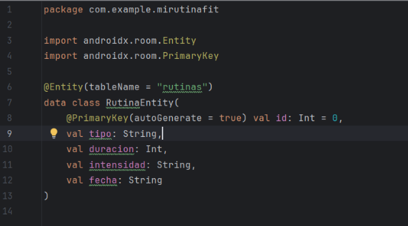
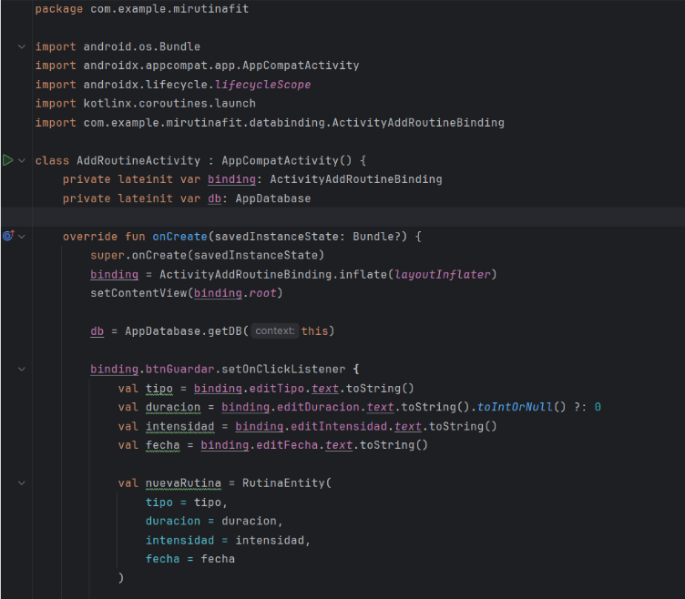
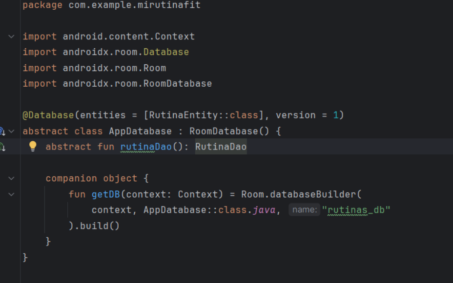
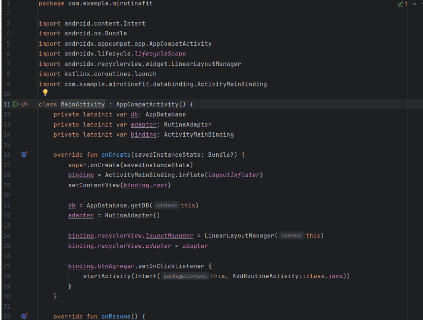
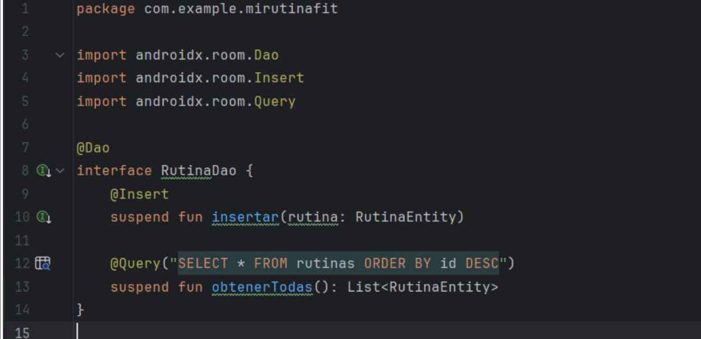
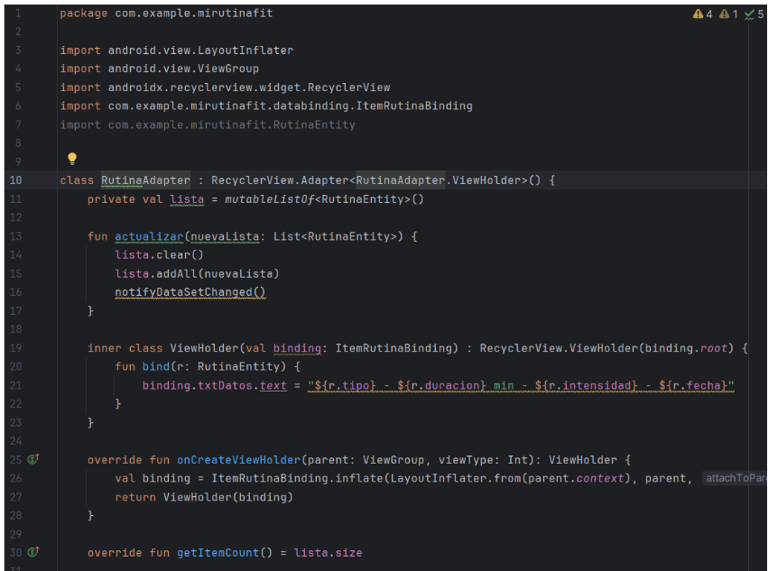

# proyectoDesarrolloM Camilo Almanza y Kevin Alejandro López Hernández

## Capturas del Código (UX del Módulo)

A continuación se presentan capturas clave del funcionamiento del módulo, enfocadas en la experiencia de usuario (UX), la navegación, y los puntos críticos del flujo:

### 1. Código

### 2. Código

### 3. Código

### 4. Código

### 5. Código

### 6. Código

## Experiencia de Usuario (UX)

El diseño del módulo prioriza la claridad visual y la simplicidad en la interacción del usuario. Cada vista fue pensada para que el usuario comprenda de forma intuitiva qué debe hacer:

- **Formulario limpio** y accesible desde la pantalla principal.
- **Mensajes de validación** claros en caso de errores o campos vacíos.
- **Flujo lógico** desde el ingreso de datos hasta su visualización.

